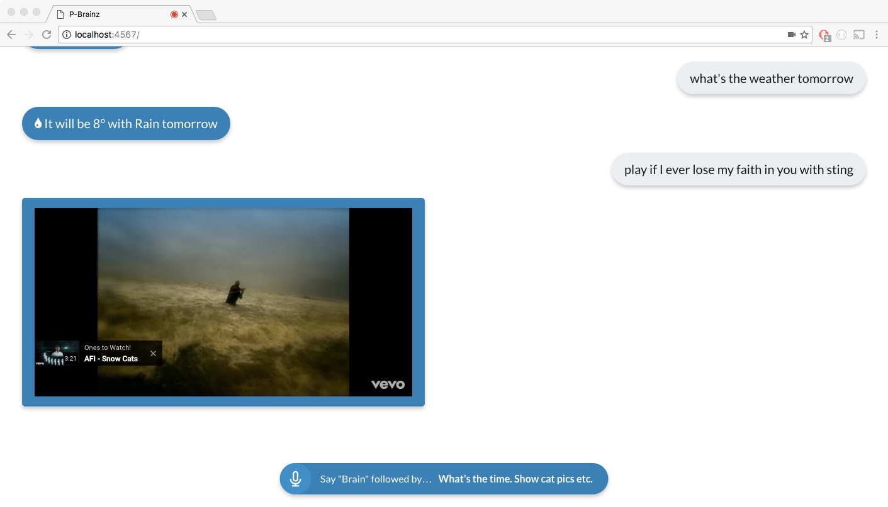

# P-Brain.ai - Voice Controlled Personal Assistant

Natural language virtual assistant using Node + Bootstrap

### Screenshot

## Install

Clone repo, cd to its directory and type `npm install` & `npm start`

Add api info for http://openweathermap.org/api and https://newsapi.org/account to `config/index.js`

Open Chrome and enter http://localhost:4567/

Say `Hey Brain`, `Brain` or `Okay Brain` followed by your query (i.e `Hey Brain, What is the weather in Paris`).

## Adding Skills

Add a skill by creating a new folder with the name of your new skill and adding an `index.js`. 

Add functions for `_intent` and `{skill_name}_resp` to that index, the latter contining the logic that reponse to the query.

In `_intent` add `return {keywords:['key 1','key 2'], module:'module_name'}` where `keywords` are the phrases you wish the skill to respond to and `module` is the name of your new skill.

Add `module.exports = {intent:_intent, get: {module_name}_resp};` to the end of your `index.js`

Add that new folder to the `skills` directory in the project.

And bang, Brain will automatically import and enable your new skill!

### End Points
`http://localhost:4567/api/ask?q={query}`
`http://localhost:4567/`
